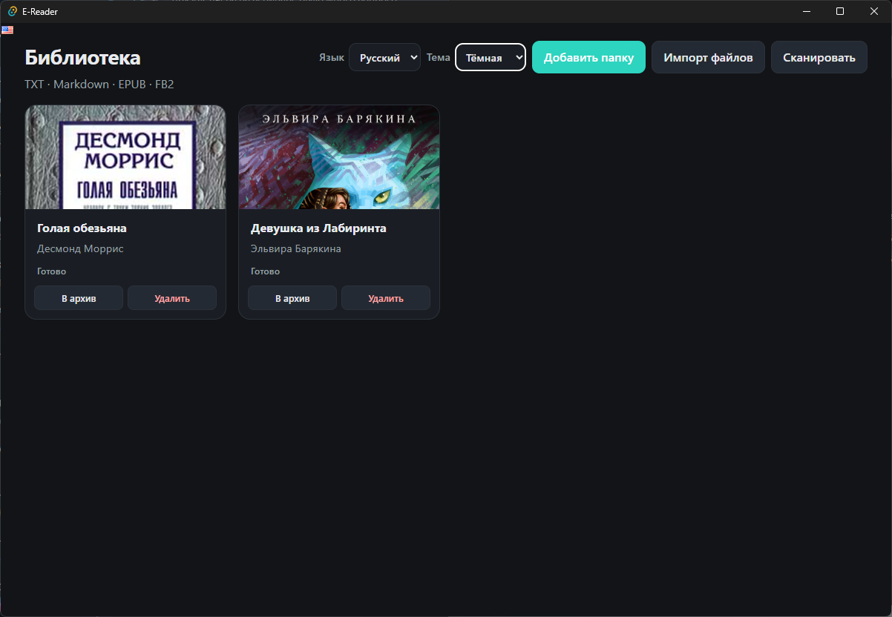
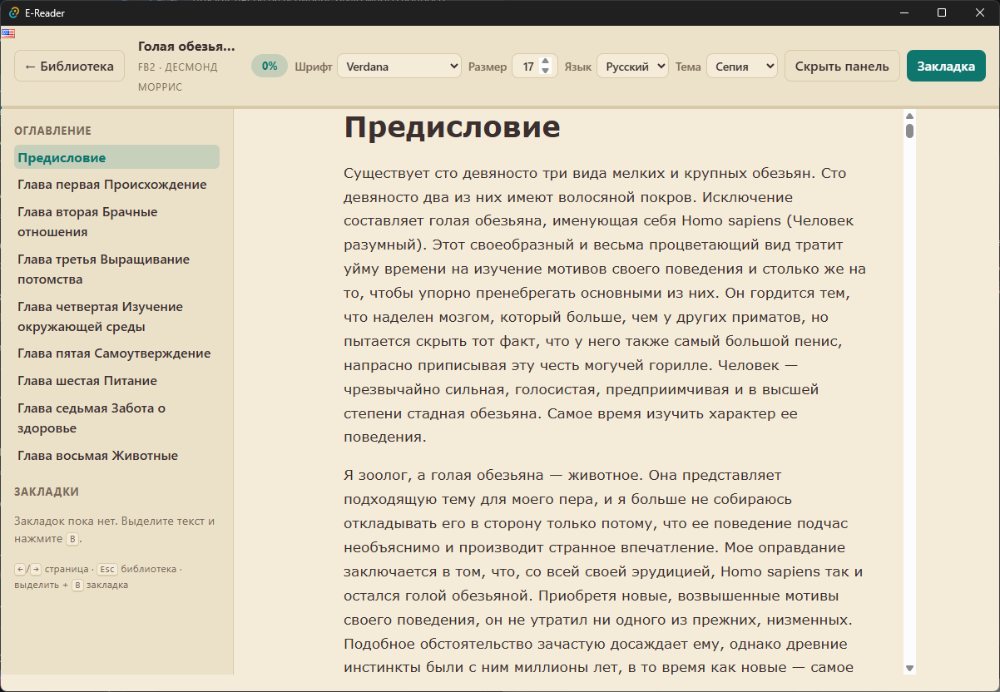

# E-Reader

**Version 1.2.0** · [Changelog](./CHANGELOG.md)

> 🇷🇺 [Russian README](./README.md)

Desktop e-reader (Windows-first, cross-platform ready) built with **Rust + Tauri 2 + SvelteKit**.

| Format | Indexed | Readable | Metadata / covers |
|--------|---------|----------|-------------------|
| TXT | yes | yes | filename title |
| Markdown (`.md`, `.markdown`) | yes | yes + TOC | H1 title |
| EPUB | yes | yes + TOC + images | title, author, cover |
| FB2 | yes | yes + TOC + images | title, author, cover |

## Screenshots

<p align="center">
  
</p>

<p align="center"><em>Library: covers, archive & delete, language and theme</em></p>

<p align="center">
  
</p>

<p align="center"><em>Reader: table of contents, font controls, bookmarks</em></p>

## Features

- UI in **Russian** and **English** (language picker in library and reader; preference is saved)
- Shared theme and language: change on the library screen or in the reader — both persist
- Hybrid library: folders and/or individual file import
- SQLite: books, progress, bookmarks, reader settings
- **Archive** (compact collapsible list) and **delete** books from the library
- Reader themes (sepia / light / dark)
- **Reader typography**: font family picker (Georgia, Times, Arial, Segoe UI, and more) and numeric size (12–40 px), saved in settings
- **Stable reading positions**: document fraction + nearest section anchor
  (survives font-size changes better than raw pixel offsets; old `scroll:px` still works)
- Active TOC highlight while scrolling
- Keyboard: `←`/`→` or `PageUp`/`PageDown` page-step, `Esc` back, `B` bookmark
- Cover extraction for EPUB/FB2 (shown in library grid)
- Windows installers (NSIS + MSI)
- Open-with / CLI: launch the app with a book path to import + open
- Drag-and-drop books or folders onto the window
- In-reader links: external pages open in the system browser; downloadable books are imported into the library

## Prerequisites

- [Rust](https://www.rust-lang.org/) (stable)
- [Node.js](https://nodejs.org/) 20+
- Windows: MSVC Build Tools (for Tauri)

## Run

```bash
npm install
npm run tauri:dev
```

Sample books live in `samples/`:

- `plain.txt`, `welcome.md`
- `example.epub` (from rbook test fixtures)
- `sample.fb2`

Use **Import files** or **Add folder** → point to `samples`.

## Build (Windows installer)

```bash
npm run tauri:build
```

Artifacts appear under `src-tauri/target/release/bundle/`:

- `nsis/*.exe` — current-user installer
- `msi/*.msi` — MSI package

## Open with & drag-and-drop

- **Double-click / Open with** (after install with file associations): app imports the file and opens it.
- **CLI**: pass paths after the binary, e.g. `E-Reader.exe samples\welcome.md`
- **Drag-and-drop**: drop `.epub` / `.fb2` / `.md` / `.txt` files or a folder onto the window.
  - Files are imported; folders become library roots and are scanned.
  - If at least one file was imported, the first one opens in the reader.

## Keyboard (reader)

| Key | Action |
|-----|--------|
| `←` / `PageUp` | Previous page-step |
| `→` / `Space` / `PageDown` | Next page-step |
| `Home` / `End` | Start / end of book |
| `B` | Add bookmark |
| `Esc` | Back to library |

## Architecture

```
src/                      SvelteKit UI (library + reader)
src-tauri/src/
  commands.rs             Tauri IPC
  db.rs                   SQLite
  download.rs             Import books from remote URLs
  formats/
    txt.rs                TXT → HTML
    markdown.rs           Markdown → HTML + TOC
    epub.rs               EPUB via rbook (chapters, images as data URIs)
    fb2.rs                FB2 → HTML via fb2 crate
  models.rs               DTOs
```

App data (`library.db`, `covers/`) lives in the OS app data dir for `com.mafka.ereader`.

## Roadmap

1. ~~Scaffold Tauri + SQLite + IPC~~
2. ~~TXT + Markdown reading~~
3. ~~EPUB reading~~
4. ~~FB2 → HTML~~
5. ~~Covers + metadata~~
6. ~~Stable progress positions + Windows packaging~~
7. ~~Open-with / drag-drop import path from OS~~
8. ~~Typography, in-reader links, archive & delete (v1.2)~~
9. Optional cloud sync (later)
